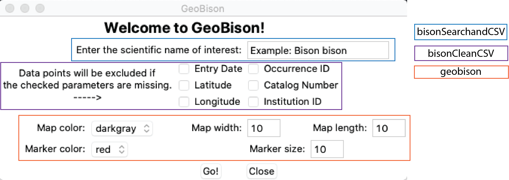
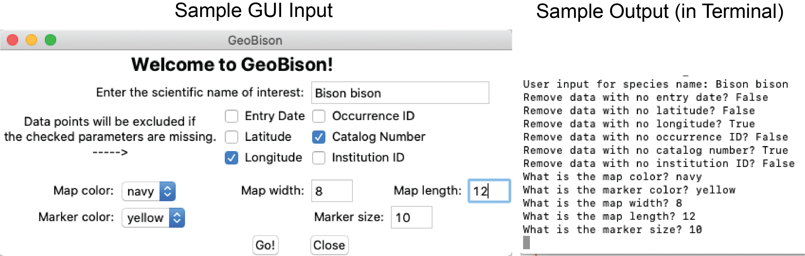
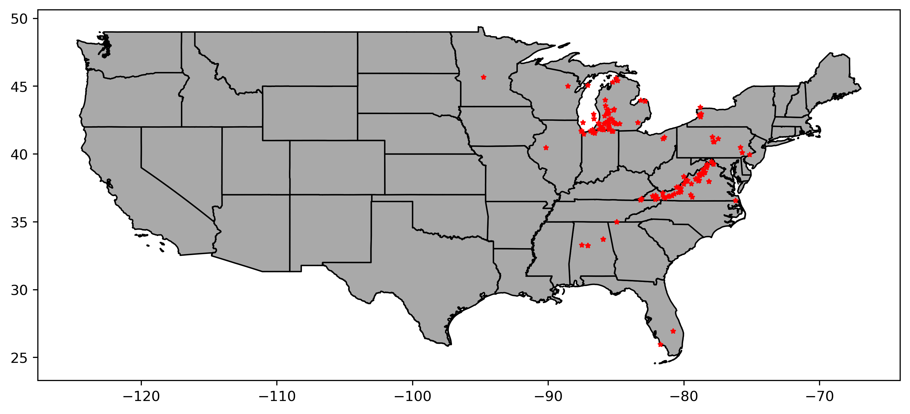

# *GeoBison*: a Python-implemented toolkit for acquiring, cleaning and visualizing geographic occurrence data of species in the contiguous United States

Nicholas Gladstone, Annie Maguire, and Madison Watkins

## Summary

The functions in this toolkit allow for the acquisition, cleaning/filtering, and visualization of species occurrence data sourced from the U.S. Node the Global Biodiversity Information Facility - BISON (Biodiversity Information Serving Our Nation).

## Quick tutorial for those who don't want to read to full documentation

### Getting started

Open up your terminal or preferred terminal environment. Then, install and import the following packages:

```
os
shutil
requests
csv
tkinter
numpy
pandas
geopandas
matplotlib
shapely
descartes

[from Annie -- I think we have them all now, yes?]

```
*Note: we recommend utilizing the Anaconda software distribution (v.3.7), as most of these packages are already included along with beginner-friendly coding environments (e.g., Spyder). This can be downloaded at: https://www.anaconda.com/distribution/#download-section
You can then install any missing packages at the command line:
```
conda install <packagename>
```


After installing the necessary packages, download and run the desired script in this repo.
*How this repo is organized: The **bisonAllParts.py** contains all functions in this toolkit, including a graphical user interface (GUI). If you would rather run an individual module through the command line (for example if you are using the Alabama Super Computer), you can find individual scripts in the directory *Individual Scripts*.

You are now ready to go!

### Using *bisonAllParts.py*

For a more user-friendly experience, we have provided a GUI, or graphical user interface, that eliminates the need for command-line coding. Please note that the GUI may not be compatible with remote computing systems such as the Alabama Supercomputer Center. A picture of the GUI is shown below, with sections outlined in color-coded boxes corresponding to each individual script. More detailed information on how these scripts work is provided later in this document.



To run the GUI from command line, type:
```
>>>python3 bisonAllParts.py
```
The GUI will appear, and you can type the scientific name of your species of interest and select options for the data-cleaning and map-drawing portions of the toolkit. Once you click "Go", a series of print statements will appear in the terminal to confirm the options you selected (see GUI and corresponding print statements below).



*Please note that it may take several minutes to retrieve all of the entries from the BISON database.*

After the GUI has run successfully, there will be 4 new files in your working directory: *bisonCSV.csv* (uncleaned), *bisonCSV.cleaned.CSV* (after passing through *bisonCleanCSV.py*), *my_new_map.png* (a map produced by *geobison.py*), and *state_counts.txt* (a text file of how many counts of your species were recorded by state, produced by *geobison_count.py*). 

### Using *bisonSearchandCSV*

To initially obtain your data you must use *bisonSearchandCSV*. This will take the user's input (scientific name of desired organism) and search BISON's Solr API for all records of the instance. These records are then converted into a CSV format, located in the output file *bisonCSV.csv*.

*bisonSearchandCSV* as described is a section of **bisonAllParts.py** that works by iterating each instance of a record through a for loop, writing the contents of each record to *bisonCSV.csv*. If *bisonSearchandCSV.py* is run without the GUI in a Linux-based terminal, like the Alabama Super Computer (ASC) terminal, the script must be run as such:

```
python3 bisonSearchandCSV.py genus species
```
where "genus species" is the scientific name, written in that order. *bisonCSV.csv*'s designated fields for the CSV are:
- event date
- latitude
- longitude
- occurrence ID
- catalog number
- institution ID

If one of these are missing from the report, the column for that field is filled with "-".

Inside the *Examples* directory are *bisonCSV.csv* and *uncleaned_species_test.csv*, which are both examples of CSV files generated by the script. *match_result.json* shows the format of the reports pulled from the API before they are parsed for the information we need.

### Using *bisonCleanCSV*

*bisonCleanCSV* is capable of cleaning the generated CSV file from *bisonSearchandCSV*, if desired. The user can decide which field to filter, resulting in the removal of all records that possess "-" in that field. A new cleaned CSV, *bisonCSV.cleaned.CSV* is created, only containing records that passed the filtering step. Multiple options may be selected for specific filtering.

Each option's cleaning ability is defined by the function *action(column)*, where column refers to the cleaning option's column in the CSV. When an option is selected, an intermediate file *bisonCSV.cleaned.int.csv* is opened. A for loop checks each row in the column of the option for "-", and if "-" is not present that row is written into the new intermediate file. Once the loop has iterated through each record, the intermediate is renamed into *bisonCSV.cleaned.csv*. If no options are selected *bisonCSV.csv* and *bisonCSV.cleaned.csv* will contain the same contents.

This script may also be run individually, and if run should be used as such:

```
python3 bisonCleanCSV.py [-h] [-e] [-a] [-g] [-o] [-c] [-i]
```

where the options are as follows:
- -h, --help  show this help message and exit
-  -e, --evt   Removes all data without event date
-  -a, --lat   Removes all data without latitudes
-  -g, --lng   Removes all data without longitudes
-  -o, --occ   Removes all data without occurrence ID
-  -c, --cat   Removes all data without catalog number
-  -i, --ins   Removes all data without institution ID

*bisonCSV.cleaned.csv* is further used in *GeoBison*.

### Using *GeoBison*

For producing a visualization of your occurrence data pre- or post- cleaning, you will use the *geobison* function:

```
geobison('INPUT_DATA.csv', output=[OUTPUT DIRECTORY HERE], map_color='COLOR OPTION HERE',
             map_size=(DIMENSIONS OF IMAGE HERE), marker_color='COLOR OPTION HERE', marker_size=[SIZE VALUE HERE])
```

The defaults for *geobison* are:

output=os.getcwd()  # i.e., your current working directory
map_color='darkgray'
map_size=(11,9)
marker_color='red'
marker_size=10

*Note: if you need a list of available color options on python, please visit https://python-graph-gallery.com/196-select-one-color-with-matplotlib/*

Using the *cleaned_species_test.csv* file in the repo, the output visualization will be:



For producing a quick summary file of how many records there are total, including a list of how many records are in each individual state within the contiguous U.S., you will use the *geobison_count* function:

```
geobison_count('INPUT_DATA.csv', output=[OUTPUT DIRECTORY HERE])
```

As with *geobison*, the default output is the cwd.


